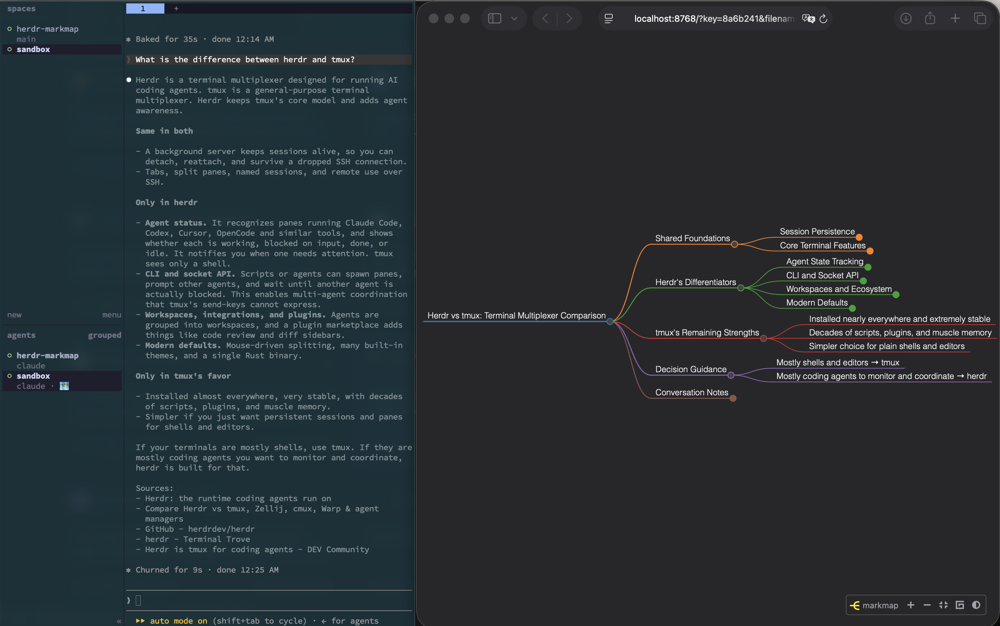

# herdr-markmap

A [Herdr](https://herdr.dev) plugin that turns an AI coding agent's conversation into a live [Markmap](https://markmap.js.org) mind map.



The agent's pane is on the left, its mind map in the browser on the right, refreshing as the conversation goes on. The root heading is a title the summarizer wrote for the topic ("Herdr vs tmux: Terminal Multiplexer Comparison"), not the workspace or directory name, and the `🗺` next to the agent in Herdr's sidebar is the `$mindmap` token this plugin reports while it watches the pane.

- **Non-interfering.** The agent's conversation history (Claude Code's session JSONL) is watched read-only. Nothing is written to the agent's history or context.
- **Incremental.** The mind map grows by merging new turns as branches under the existing headings. Existing headings below the root are never removed or renamed; a Python-side check enforces it. The root is a short title describing what the conversation is about (not the directory name) and may be retitled as the topic evolves.
- **Event-driven.** Herdr fires `pane.agent_status_changed` when an agent finishes a turn (idle / done). One short-lived process merges the new turns. There is no daemon.
- **Isolated summarizer.** Each merge runs `claude -p` as a one-shot process with session persistence, settings, hooks and tools disabled, so the main agent's context is untouched. An Anthropic API backend is available as an alternative.

## How it works

A fuller picture, with module dependencies, is in [docs/ARCHITECTURE.md](docs/ARCHITECTURE.md).

```
agent pane (Claude Code, ...)  ──appends──▶  ~/.claude/projects/<slug>/<session>.jsonl
        │                                              ▲ read-only
        │ pane.agent_status_changed (idle / done)      │
        ▼                                              │
  Herdr event hook ─▶ python -m markmap_pipeline.plugin on-status
                          ├─ wait settle_seconds, read new turns from the JSONL
                          ├─ claude -p (one-shot, no session, no tools) merges them
                          ├─ verify every existing heading survived, write atomically
                          └─ update the $mindmap sidebar token (🗺 … → 🗺)
                                        │
   <agent cwd>/.mindmap/<workspace>.md ─┴─▶ markmap -w (background) ─▶ browser (live reload)
```

Actions run from the pane that hosts the agent, so there is nothing to type: Herdr passes the pane, the agent kind, its working directory and the workspace label to the plugin.

## Requirements

- macOS or Linux (Windows is not supported: the plugin uses `fcntl` file locks)
- Herdr 0.8.2 or newer (verified on 0.8.2)
- Python 3.9 or newer as `python3` (the plugin itself uses only the standard library)
- Node.js with `markmap-cli` for the live preview
- A logged-in Claude Code CLI (`claude`) for the default summarizer backend. Merges run on the account that is logged in and are billed to it.

```bash
npm install -g markmap-cli
```

## Install

From GitHub (the build step creates the virtualenv the plugin runs in; no packages are installed):

```bash
herdr plugin install maaalo/herdr-markmap
herdr plugin list
```

From a local checkout, link it instead. `herdr plugin link` does not run build steps, so create the virtualenv yourself:

```bash
cd herdr-markmap
python3 -m venv .venv
herdr plugin link "$PWD"
herdr plugin action list --plugin maaalo.herdr-markmap
```

If you edit `herdr-plugin.toml`, re-register the plugin with `herdr plugin unlink maaalo.herdr-markmap && herdr plugin link "$PWD"`. Python changes take effect immediately.

## Usage

1. Focus the pane that hosts the agent you want to map.
2. Run **Mind map: watch this agent** (`maaalo.herdr-markmap.start`) from the command palette, a keybinding, or the CLI:

   ```bash
   herdr plugin action invoke maaalo.herdr-markmap.start
   ```

   The first mind map is generated and a `markmap -w` preview server starts in the background. No pane is opened.
3. Run **Mind map: open preview in browser** (`maaalo.herdr-markmap.open-preview`) to open the live preview. If the pane is not being watched yet, this action starts watching first and opens the browser before the initial merge; the page reloads when the merge lands.
4. Every time the agent finishes a turn (status idle or done), the new turns are merged into the map. The turns appear right away under a pending section, then move to their place once the model's patch lands (the model returns only the additions as JSON; the map is patched in Python, so existing headings can never be lost).
5. Run **Mind map: stop watching this agent** (`maaalo.herdr-markmap.stop`) to stop. **Mind map: toggle watching this agent** (`maaalo.herdr-markmap.toggle`) starts or stops depending on the current state, which suits a single keybinding. **Mind map: show watched agents** (`maaalo.herdr-markmap.status`) lists watched panes with their preview URLs.

Action results (started, stopped, preview URL, errors such as "no agent in this pane") are shown as Herdr notifications. Details are in the plugin log:

```bash
herdr plugin log list --plugin maaalo.herdr-markmap --limit 10
```

### Keybindings

```toml
# ~/.config/herdr/config.toml
[[keys.command]]
key = "prefix+m"
type = "plugin_action"
command = "maaalo.herdr-markmap.start"
description = "mind map: watch this agent"

[[keys.command]]
key = "prefix+M"
type = "plugin_action"
command = "maaalo.herdr-markmap.stop"
description = "mind map: stop watching this agent"

[[keys.command]]
key = "prefix+t"
type = "plugin_action"
command = "maaalo.herdr-markmap.toggle"
description = "mind map: toggle watching this agent"

[[keys.command]]
key = "prefix+o"
type = "plugin_action"
command = "maaalo.herdr-markmap.open-preview"
description = "mind map: open preview"
```

### Sidebar marker

Watched panes report a `$mindmap` metadata token (default 🗺). Add it to the Agent rows in your Herdr config to see it next to the agent in the left sidebar. While a merge is running the token reads `🗺 …`; after a failed merge it reads `🗺 !`.

```toml
# ~/.config/herdr/config.toml
[ui.sidebar.agents]
rows = [["state_icon", "workspace", "tab"], ["agent", { token = "$mindmap", fg = "#89b4fa" }]]
```

The sidebar is drawn by Herdr, so the marker is not clickable. Use the **open preview** action (or its keybinding) to open the URL.

## Files and configuration

| Location | Contents |
| --- | --- |
| `<agent cwd>/.mindmap/<workspace label>.md` | The mind map (Markdown with Markmap front matter) |
| `~/.local/state/herdr/plugins/maaalo.herdr-markmap/agents/` | Registry of watched panes |
| `~/.local/state/herdr/plugins/maaalo.herdr-markmap/positions/` | Processed position in each history file |
| `~/.local/state/herdr/plugins/maaalo.herdr-markmap/previews/` | Output of the background `markmap` processes (contains the URL) |
| `~/.config/herdr/plugins/config/maaalo.herdr-markmap/config.json` | Settings; written with defaults on the first `start` |

`config.json` keys:

| Key | Default | Meaning |
| --- | --- | --- |
| `output_dir` | `null` (`.mindmap/` under the agent's cwd) | Where mind maps are written; `~` is expanded |
| `model` | `claude-opus-5` | Model used for summarizing |
| `backend` | `claude-cli` | `claude-cli` (one-shot `claude -p`) or `anthropic` (experimental: Anthropic SDK, needs `ANTHROPIC_API_KEY` and `pip install anthropic`) |
| `effort` | `null` | Reasoning effort for the initial build (`low`–`max`); the backend default when unset |
| `merge_effort` | `medium` | Reasoning effort for incremental merges. Patches need little reasoning: on Opus 5 a merge drops from ~11 s to ~5 s |
| `scratch_dir` | `null` (temp dir) | Working directory for `claude -p`, kept outside the project |
| `max_retries` | `1` | Retries when the model drops an existing heading |
| `settle_seconds` | `1.5` | Delay after the status change before reading the history, so the last line is fully written |
| `trigger_statuses` | `["idle", "done"]` | Agent statuses that trigger a merge |
| `lock_timeout` | `120` | Seconds to wait for a running merge on the same map before giving up |
| `preview` | `true` | Run the background `markmap -w` preview server |
| `preview_port_base` | `8765` | First port tried for preview servers; the next free port is used |
| `sidebar_token` | `mindmap` | Name of the sidebar token (`$mindmap`) |
| `sidebar_icon` | `🗺` | Token value shown for watched agents |
| `notify` | `false` | Also show a Herdr notification after each event-driven merge |
| `instant_placeholder` | `true` | Show the new turns in the map immediately under a pending section while the model merges them |

## What the plugin reads, writes and sends

Review this before installing; Herdr does not sandbox plugins.

**Reads**

- The watched agent's Claude Code history (`~/.claude/projects/<slug>/<session>.jsonl`), opened read-only. For other agent kinds, terminal snapshots via `herdr agent read`.
- Pane, agent and workspace metadata through the Herdr CLI (`HERDR_BIN_PATH`) and the environment Herdr injects into plugin commands.

**Writes**

- The mind map: `<agent cwd>/.mindmap/<workspace label>.md` (or `output_dir`), plus a `.<name>.md.lock` file next to it.
- Its own state under `~/.local/state/herdr/plugins/maaalo.herdr-markmap/` (registry, processed positions, preview server logs) and `config.json` under `~/.config/herdr/plugins/config/maaalo.herdr-markmap/`.
- Sidebar metadata tokens and notifications through the Herdr CLI. Nothing is written to the agent's history, session, settings or working files.

**Sends**

- Each merge sends the new conversation turns and the current mind map (its headings and text) to Claude, through the logged-in `claude` CLI (`claude -p`) or, with `backend: "anthropic"`, the Anthropic API. This is the only network use by the plugin itself, and it is billed to that account. Conversations you consider sensitive should not be watched.
- The preview server (`markmap -w`) listens on all interfaces of the machine, not just localhost: markmap-cli has no bind-address option. Anyone on your network who knows the URL (including its random `key`) can view the map. Use `"preview": false` or a firewall on machines that share a network with untrusted hosts.
- No telemetry, no credentials stored: authentication is whatever `claude` or the Anthropic SDK already has.

## Non-interference details

- The history JSONL is opened read-only. The plugin writes only its own mind map, registry, position and log files.
- The summarizer runs as:

  ```bash
  claude -p --no-session-persistence --setting-sources "" --tools "" --output-format text --system-prompt ... --model ...
  ```

  with a working directory outside the project, so no session is saved and the project's CLAUDE.md and hooks are not loaded. `--bare` is deliberately not used: on macOS it skips keychain access and fails with "Not logged in".
- Model output is validated. If any existing heading below the root is missing, or the output does not have exactly one root heading, the merge is retried with the problems listed; if it still fails, the existing map is kept and the new turns are appended under an "unsorted" section.
- Writes go through a temporary file and an atomic rename, so `markmap -w` never sees a half-written file.
- The mind map is written in the language the user types their prompts in, whatever it is. Before each update a small extra model call is asked for the name of the language of the `[user]` lines (or of the existing map's headings when those lines are too short, e.g. "ok"), and that name is stated explicitly in the prompts ("Write the entire mind map in English"). A rule alone was not enough: Claude Code adds account context even in `-p` mode, and with only "write in the language of the [user] lines" English conversations still came out in the account holder's language. The prompts themselves are English. The two sections the plugin writes itself ("Unsorted", "Latest (pending merge)") are always English. If the detection call fails or answers "unknown", the update runs with the rule-only prompt. The prompts also steer the model to keep the existing tree.

## License

[MIT](LICENSE)
