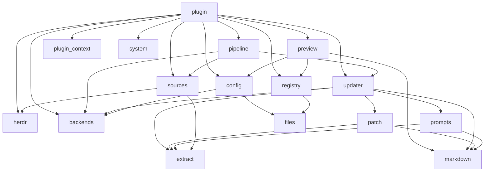

# Architecture

`herdr-markmap` is a Herdr plugin. There is no daemon: every piece of work is a short-lived process that Herdr starts, either because the user ran an action or because a watched agent changed status.

## Runtime flow

| Module | Responsibility |
| --- | --- |
| `plugin.py` | Subcommands and the `Deps` bundle of side effects (Herdr CLI, the merge, plus the OS operations of `system.py`). Tests substitute `Deps`. |
| `system.py` | OS side effects: port checks, background processes, signals, log reads, browser. |
| `preview.py` | Background `markmap -w`: port selection, start, stop, URL recovery, restart. |
| `plugin_context.py` | The `HERDR_*` environment of one plugin command: pane, agent, event, directories. |
| `config.py` | `config.json`: defaults, hand-edited overrides, where a pane's map is written. |
| `registry.py` | The watched panes, one JSON entry per pane, and the paths derived from a pane id. |
| `pipeline.py` | Processed-position state, one merge cycle, per-output file lock. |
| `updater.py` | One merge: language detection, prompt, patch (or fallback append), write. |
| `sources.py` | History file resolution and incremental reads; `herdr agent read` fallback. |
| `backends.py` | `claude -p` and Anthropic SDK backends. |
| `markdown.py` | The document: the section/heading parser, front matter, output cleanup, skeleton. |
| `patch.py` | JSON patch insertion and the plugin's own sections (unsorted fallback, pending placeholder). |
| `files.py` | Safe file names, atomic writes, JSON load/store. |
| `prompts.py` | Language detection, initial and incremental prompts. |
| `extract.py` | JSONL lines → conversation turns. |
| `herdr.py` | Thin Herdr CLI wrapper (`run_json`, `agent_read`). |

## Non-interference guarantees

1. The history is opened read-only; the plugin's own state lives under `~/.local/state/herdr/plugins/maaalo.herdr-markmap/`.
2. The summarizer runs as `claude -p --no-session-persistence --setting-sources "" --tools ""` with a working directory outside the project, so no session, settings or hooks are shared with the agent.
3. Model output is validated (headings below the root preserved, exactly one root); on failure the existing map is kept and new turns are appended under an unsorted section.
4. Writes go through a temporary file and an atomic rename.
